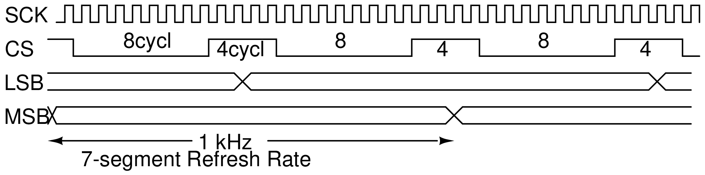

# VLSI-2025
Portal for 2025 Slicon University batch being mentored at the Advanced VLSI Lab.

# TABLE OF CONTENT

- [Resources](#RESOURCES)
  - [Reference](#References)
  - [Useful Links](#useful-Links)
- [Tasks & Assignments](#TASKS-and-ASSIGNMENTS)
- [Projects](#projects)
  - [SPI-based TEMPERATURE MONITOR](#SPI-based-TEMPERATURE-MONITOR)
- [Electronic Design Automation (EDA) Software](#ELECTRONIC-DESIGN-AUTOMATION-SOFTWARE)
  - [Installing Icarus Verilog with GTKWave](#INSTALLING-ICARUS-VERILOG-with-GTKWAVE)

# RESOURCES

## References
- [**Mano**] Mano, M. Morris, and Michael D. Ciletti. **Digital Design**: With an Introduction to the **Verilog** HDL. Pearson, 2012. [`DBURL/s/54xsb46wcj6hdn9/ManoCiletti-DigitalDesignWithIntroToVerilog-5thEd-2012.pdf`]. -- Classic text on digital theory with a nice intro to HDL. 
- [**West**] Weste, Neil, and David **Harris**. **CMOS VLSI Design**: A Circuits and Systems Perspective. Pearson Education, 2011. [`DBURL/s/ard8jntcpq1pt45/Weste-Harris-CMOS-VLSI-design-Pearson-4thEd-2011.pdf`] -- An excellent reference on Digital VLSI design and VLSI design process as well.
  - [**Web Companion**] http://pages.hmc.edu/harris/cmosvlsi/4e/index.html
  - **Annotated Chapters for Processing** [`DBURL/s/zxp1dnwknvpfz8y/Weste-JohnsMartin-CMOSprocessing-Layout-Highlight-annotate.pdf`
- [**Kang**] Leblebici, Yusuf, Chul Woo Kim, and Sung-Mo (Steve) Kang. **CMOS Digital Integrated Circuits Analysis & Design**. 4th ed. McGraw-Hill Education, 2014. [`DBURL/s/axtrki5yilzg8zs/Kang-CMOS-DigitalIC-4thIE-McGrawHill-2015.pdf`] -- Classic text on CMOS VLSI Design.
- [**Hodges**]] Hodges, David A., and David. **Analysis And Design Of Digital Integrated Circuits**, In Deep Submicron Technology (Special Indian Edition). Tata McGraw-Hill Education, 2005. [`DBURL/s/olc3j7hkarlwila/HodgesJackson-DesignAndAnalysisOfDigitalIC-3Ed-McGraw-2005.pdf`]. -- Another classic text on CMOS VLSI Design.
- [**Palnitkar**] Palnitkar, Samir. **Verilog HDL**: A Guide to Digital Design and Synthesis. Prentice Hall Professional, 2003. [`DBURL/s/h5qxwwff3qxl58z/PalnitkarSamir-VerilogHDL-2ndEd-2003.pdf`]. -- Classic text on Verilog.
- [**Mishra**] Mishra, Kishore. **Advanced Chip Design**: Practical Examples in Verilog, 2013. [`DBURL/s/qb3rm97rqvri6my/MishraKishore-AdvancedChipDesign-Verilog.pdf`]. -- Lots of Verilog examples.


## Useful Links

- [An easy-to-read SPI tutorial from sparkfun](https://learn.sparkfun.com/tutorials/serial-peripheral-interface-spi)
- [Datasheet: TI SPI-based temperature sensor LM70][datasheetLM70]
- [Technical Reference: Xilinx Spartan-6 FPGA Development Board][TechRefSpartan6]


# TASKS and ASSIGNMENTS

- [`15 May 2024`]: **LIVE DEVELOPMENT SESSION**
 


  - In this live session we will calculate the necessary division ratio bewteen the FPGA input clock of **100MHz** and the output `SCK` and immplement the divider. 
  - :one: From the LM70 datasheet find out the _minimum_ and _maximum_ `SCK` frequency that can be provided to the LM70.
  - :two: Typical refresh frequency for a 7-segment display is between **60Hz to 1 kHz**. We will sample the LM70 every **12** `SCK` clock cycles as shown in the timing diagram above. Based on these two assumptions, calculate the `SCK` frequency and hence the divide ratio.
  - :three: Implement the divider to generate the above `SCK` clock frequency.
  - :four: Implement the `CS` and `SCK` logic.

- [`07 May 2024`]:
  - An empty module `verlilog/rtl/celcius.v` has been added to this repo.
  - This module represents your project **Celcius**, named after Swedish Astronomer **Anders Celcius** who invented the celsius or the centigrade scale.
  - You can now add your verilog code for the project in this module. Do NOT change the ports of this module.
  - This module has been _instantiated_ in the testbench `tb.v` and appropriately connected.
  - You will get the new code by doing a `git pull` in your _git-cloned_ directory. Make a copy of it in your working directory and do your _work_ in that directory.
  - Please complete the following tasks:
    - :one: Write a verilog code in the `celcius` module to **divide** the input clock of 100MHz to 100kHz. This will be the frequency for the SPI clock `SCK`.
    - :two: Read up about Anders Celcius and other renowned scientist responsible for temperature measurement.
 
- [`27 Apr 2024`]: 
  - A verilog model of the temperature sensor LM70 as been added: `verilog/tb/lm70.v`
  - A sample testbench `verilog/tb/tb.v` has been added. It has the LM70 instatiated and connected to clock, CS and reset.
  - Complete the following tasks:
    - :one: Update your work area by doing a `git pull`
      - If haven't already, clone the github repo into your work directory first.
    - :two: Modify the testbench to read 1-byte of data from LM70 and verify it. 
      - Hint: you just have to generate `CS` low for 8 clock pulse and monitor the `SIO` pin.
  
- [`10 Apr 2024`]: 
  - :one: Install [**WSL2**](https://github.com/silicon-vlsi-org/eda-wsl2) and install `iverilog` and `gtkwave` (See instructions [here](#INSTALLING-ICARUS-VERILOG-with-GTKWAVE))
  - :two: Follow the **first 8 lessons** in this [GitHub page](https://github.com/silicon-vlsi-org/module-cs3-301) to get familiar with and improve your skill in using Unix/Linux commands. 
  - :three: Go through the [LM70 datasheet][datasheetLM70] and understand these key specs of the sensor:
    - How to read a byte of the data using the SPI protocol.
    - Get a familiar with the SPI protocol. ([An easy-to-read SPI tutorial from sparkfun](https://learn.sparkfun.com/tutorials/serial-peripheral-interface-spi))
    - What is the accuracy of the temperature for the MSB byte.
  - :four: Come up with a basic architecture to read the 8-bit data and display it on two 7-segment displays.

# PROJECTS

## SPI-based TEMPERATURE MONITOR

This project will aim at design and immplemention of a SPI-based temperature monitor. The students will design a controller in Verilog to read the data from the sensor ([LM70][datasheetLM70]) using the industry-standard SPI protocol, convert the data to a human readable format (deg-C) and drive a set of 7-segment display to display the data. In order to test the Verilog code in realtime application, the Verilog code will be synthesized into a Xilinx's Spartan FPGA board. This will allow the students to test their Verilog code in real time.


# ELECTRONIC DESIGN AUTOMATION SOFTWARE

## INSTALLING ICARUS VERILOG with GTKWAVE

In this section we will demonstrate on how to install the open-source Verilog simulator **Icarus Verilog** (`iverilog`) and view the result using an open-source viewer **GTKWave**. 

**SOME USEFUL LINKS**:
- [iVerilog creator Steve Icarus's document page](https://steveicarus.github.io/iverilog)


The following instructions are for `iverilog` and `gtkwave` from a standard **Ubuntu 18.04** repository:

- `sudo apt update && sudo apt upgrade -y` : To update your distribution.
- `sudo apt install iverilog`
- `sudo apt install gtkwave`
- Now let's compile a simple verilog module and it's testbench: `mydut.v` and `tb_mydut.v`. An example contnet of the Verilog code is given below.
  - Create project directory say `mkdir -p ~/iverilog/test` and `cd` to that directory.
  - `iverilog -o tb_mydut.vvp mydut.v tb_mydut.v` : Compile the verilog codes and create an output `tb_mydut.vvp`
  - `vvp tb_mydut.vvp` : Convert the compiled output to a VCD format for GTKWave.
  - `gtkwave dump.vcd` : Note: the filename `dump.vcd` is assumed to be in `tb_mydut.v`

- If you want to execute the first two commands as script, you can add the first two commands to a file called say `run`:

```bash 
iverilog -o tb_mydut.vvp mydut.v tb_mydut.v
vvp tb_mydut.vvp
```

- Now mamke the file executable by typing the follwoing command: `chmod +x run`
- And from now on, you can simply execute the script by typing `./run`

- Example content of `mydut.v`:

```verilog
// Simple DUT with NAND expression 
module mydut ( input A, input B, output Y);
  assign Y = ~(A & B);
endmodule
```

- Example content of `tb_mydut.v` :

```verilog
module tb_mydut;
  reg A;
  reg B;
  wire Y, Z;
  
  mydut dut0 (.A(A), .B(B), .Y(Y));
  
  initial begin
    // Dump waves
    $dumpfile("dump.vcd");
    $dumpvars(1);
    
    A <= 0;
    B <= 0;
    #2 
    A <= 0;
    B <= 1'bx;
    #2
    A <= 1;
    B <= 1'bz;
    #2
    A <= 1;
    B <= 1'bx;
    
   #2 $finish;
  end
endmodule
```

* * *

[datasheetLM70]:	docs/datasheet-LM70-TI-tempSensor.pdf	
[datasheetDHT20]:	https://www.dropbox.com/s/9vpyqqnqopvtvbh/datasheet-temp-humidity-5193-DHT20.pdf
[TechRefSpartan6]:	docs/AHMY_SP6LX9_LT_Spartan6-TechRef.pdf
